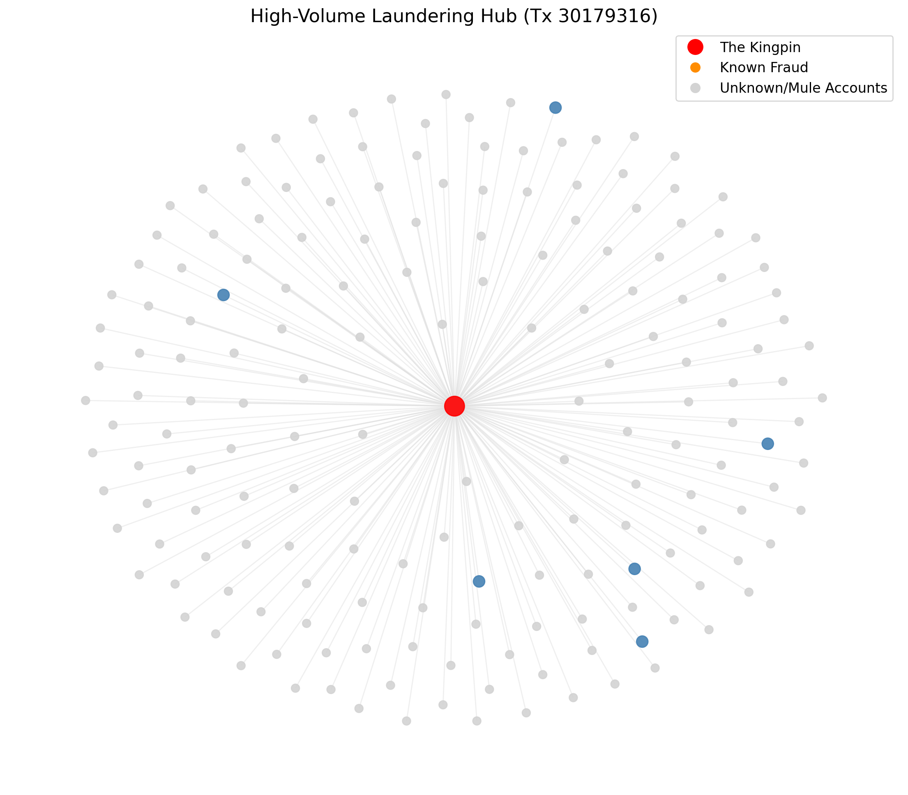
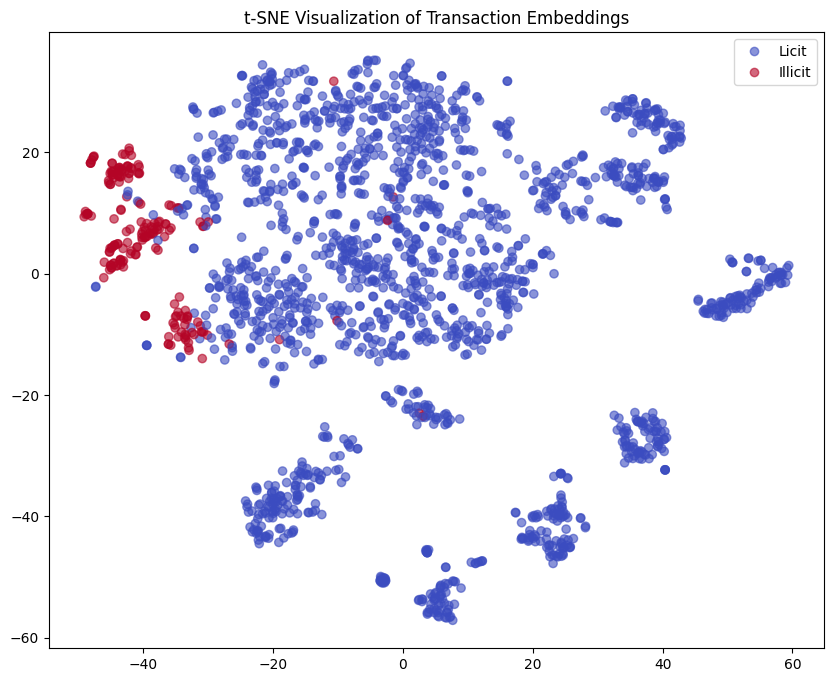

# 🕵️ Anti-Money Laundering (AML) Detection using Graph Neural Networks

## 🚨 The Problem
Traditional fraud detection systems analyze transactions in isolation (e.g., "Is this amount too high?"). Sophisticated money launderers evade this by **structuring** payments—dispersing funds through networks of thousands of disposable "mule" accounts. To catch them, we cannot just look at the *node*; we must look at the *graph*.

## 💡 The Solution
I engineered a **Graph Neural Network (GraphSAGE)** pipeline to detect illicit Bitcoin flows by analyzing the **2-hop topology** of the transaction network.
* **Dataset:** Elliptic Data Set (200k+ Bitcoin transactions).
* **Architecture:** Inductive GraphSAGE (trains on past data, generalizes to future unseen nodes).
* **Engineering Challenge:** Extreme class imbalance (90% Licit vs 10% Illicit). Solved using Weighted Cross-Entropy Loss.

## 📸 The "Smoking Gun"
**Figure 1: High-Volume Laundering Hub (Tx 30179316)**

*Visualization of a detected 'Kingpin' node. The GNN flagged this node (Red) not due to its direct features, but due to its structural role as a central distributor to hundreds of anonymous 'mule' wallets (Grey), revealing a classic 'layering' topology.*

## 📊 Results & Performance
The model significantly outperformed non-graph baselines by leveraging topological signal.

| Metric | Score | Industry Context |
| :--- | :--- | :--- |
| **Recall** | **67.2%** | Caught ~2/3rds of all illicit flows (High sensitivity). |
| **Precision** | **51.0%** | ~1 out of 2 alerts is real fraud (Excellent for AML contexts). |

### Latent Space Visualization

*Figure 2: t-SNE projection of the learned 128-dimensional embeddings. The clear separation between Illicit (Red) and Licit (Blue) clusters proves the model learned to distinguish semantic patterns in the graph structure.*

## 🛠️ Tech Stack
* **Deep Learning:** PyTorch, PyTorch Geometric
* **Graph Analysis:** NetworkX (k-hop subgraph extraction)
* **Vis:** Matplotlib, Kamada-Kawai layout
